# Unity XR Display Pre-Distortion for Distortion Correction

Unity prototypes demonstrating **image-space pre-distortion** techniques used in XR display pipelines, focusing on:

- Barrel / Pincushion Distortion
- Chromatic aberration 

The goal of this project is to show how virtual content can be **pre-distorted in software** so that, after optical distortion, the **perceived image appears correct**.
 
> All parameters are **synthetic** and chosen to make the effects clearly visible.
> 
> This repository demonstrates the *logic* of pre-distortion and correction, both of which are simulated
>
> Display pipeline:
>   **Rendered image → software pre-distortion → optical distortion → perceived image**
> The goal of pre-distortion is to ensure that, after optical distortion, the perceived image appears geometrically and chromatically correct.

---

## What this demo shows

- Barrel and Pincushion distortions and their **inverse pre-distortion correction**
- Chromatic aberration and its **inverse pre-distortion correction**
- Unity-based implementation using shaders and simple runtime controls

---

## Scenes

- **Scene 1: Barrel/Pincushion Distortion Pipeline**  
  Barrel and pincushion distortion applied to a checkerboard pattern, with toggleable pre-distortion correction.

- **Scene 2: Chromatic Aberration Pipeline**  
  Chromatic aberration applied to a Siemens sinusoidal star pattern, with toggleable pre-distortion correction.

Each scene allows visual comparison between:
- original content
- optics distortion only
- pre-distortion only
- pre-distortion + optics distortion (corrected result)

---
## Distortion model for Barrel and Pincushion distortion

Brown’s simplified Forward radial transform:

$$r_{d}=f\left(r_{u}\right)=r_{u}+c_{1} r_{u}^{3}+c_{2} r_{u}^{5}$$

Brown’s simplified Inverse radial transform:

$$f^{-1}\left(r_{d}\right) \approx \frac{c_{1} r_{d}^{2}+c_{2} r_{d}^{4}+c_{1}^{2} r_{d}^{4}+c_{2}^{2} r_{d}^{8}+2 c_{1} c_{2} r_{d}^{6}}{1+4 c_{1} r_{d}^{2}+6 c_{2} r_{d}^{4}}$$

 
---

# Images
## Barrel Distortion (Low)
<table>
  <tr>
    <td align="center" width="50%">
      
       
      <em>Reference Image</em>
    </td>
    <td align="center" width="50%">
      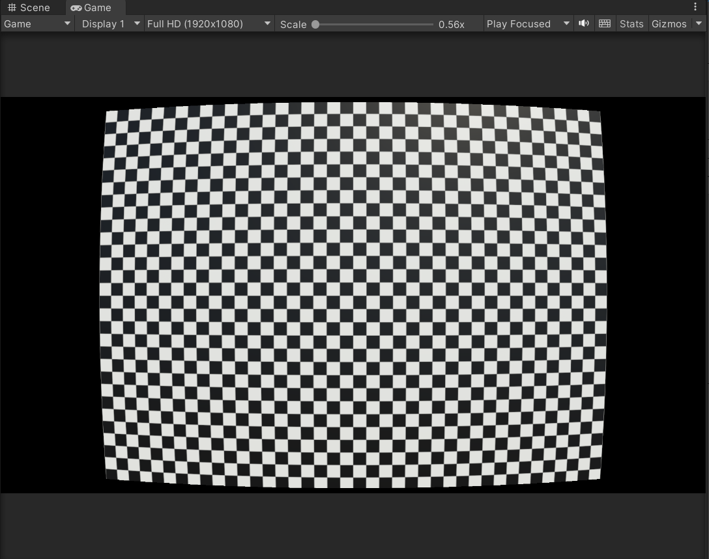
       
      <em>Simulated Barrel Distortion (Low)</em>
    </td>
  </tr>
</table>

<table>
  <tr>
    <td align="center" width="50%">
      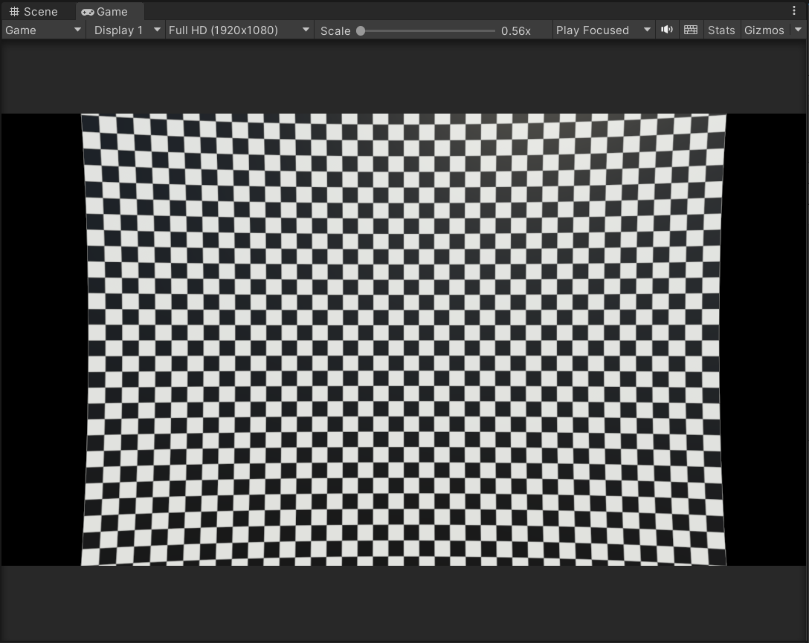
       
      <em>Pre-Corrected Image</em>
    </td>
    <td align="center" width="50%">
      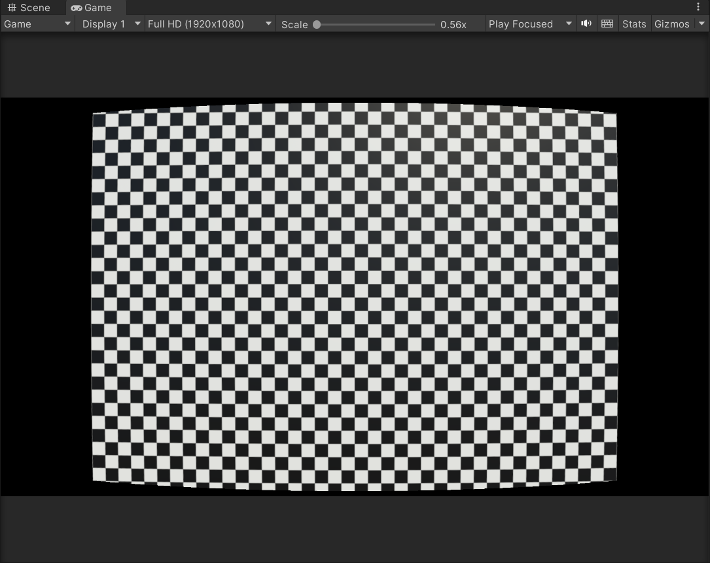
       
      <em>Distorted Image appears close to reference image</em>
    </td>
  </tr>
</table>

## Barrel Distortion (High)
<table>
  <tr>
    <td align="center" width="50%">
      
       
      <em>Reference Image</em>
    </td>
    <td align="center" width="50%">
      
       
      <em>Simulated Barrel Distortion (High)</em>
    </td>
  </tr>
</table>

<table>
  <tr>
    <td align="center" width="50%">
      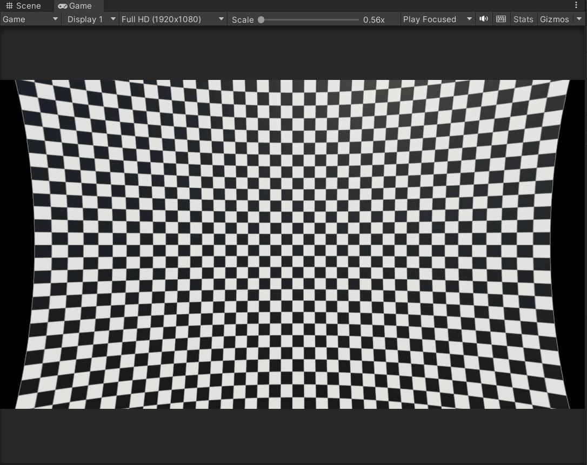
       
      <em>Pre-Corrected Image</em>
    </td>
    <td align="center" width="50%">
      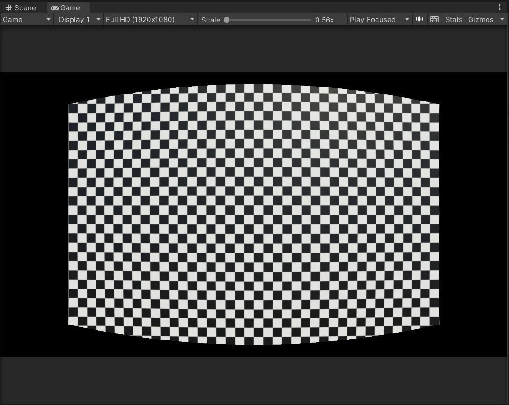
       
      <em>Distorted Image appears close to reference image</em>
    </td>
  </tr>
</table>

## Pincushion Distortion (Low)
<table>
  <tr>
    <td align="center" width="50%">
      
       
      <em>Reference Image</em>
    </td>
    <td align="center" width="50%">
      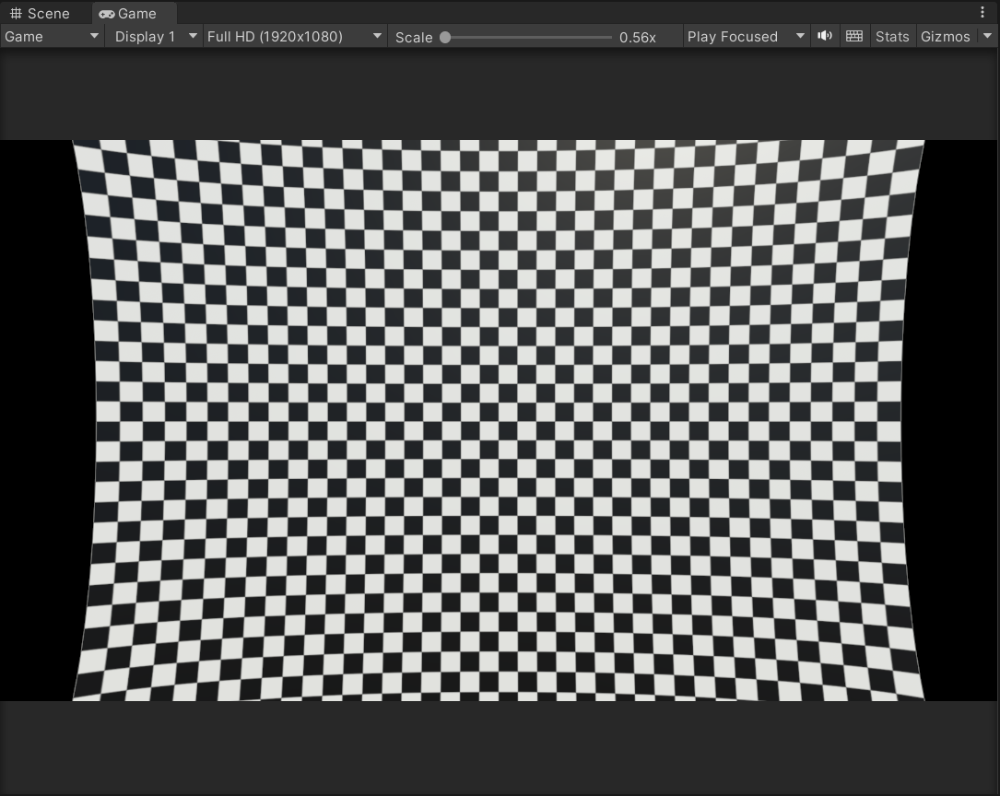
       
      <em>Simulated Pincushion Distortion (Low)</em>
    </td>
  </tr>
</table>

<table>
  <tr>
    <td align="center" width="50%">
      
       
      <em>Pre-Corrected Image</em>
    </td>
    <td align="center" width="50%">
      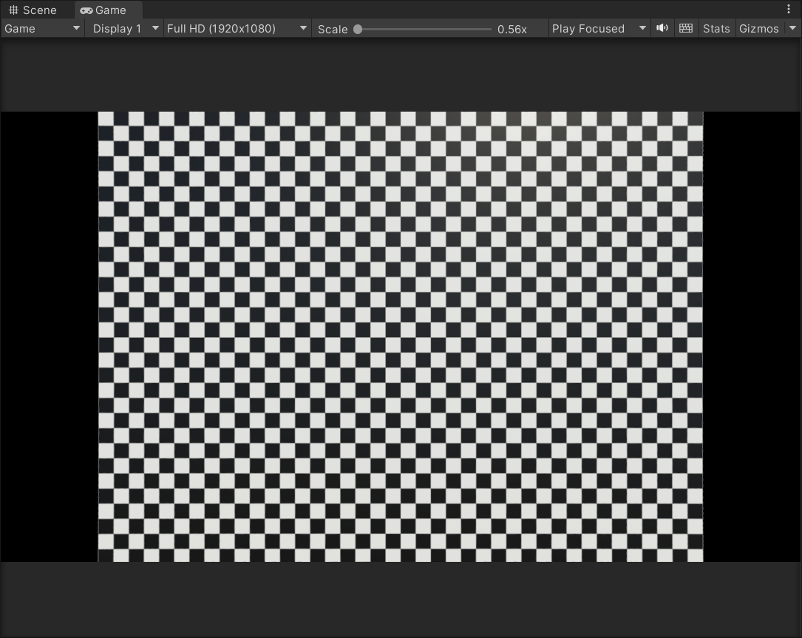
       
      <em>Distorted Image appears close to reference image</em>
    </td>
  </tr>
</table>

## Pincushion Distortion (High)
<table>
  <tr>
    <td align="center" width="50%">
      
       
      <em>Reference Image</em>
    </td>
    <td align="center" width="50%">
      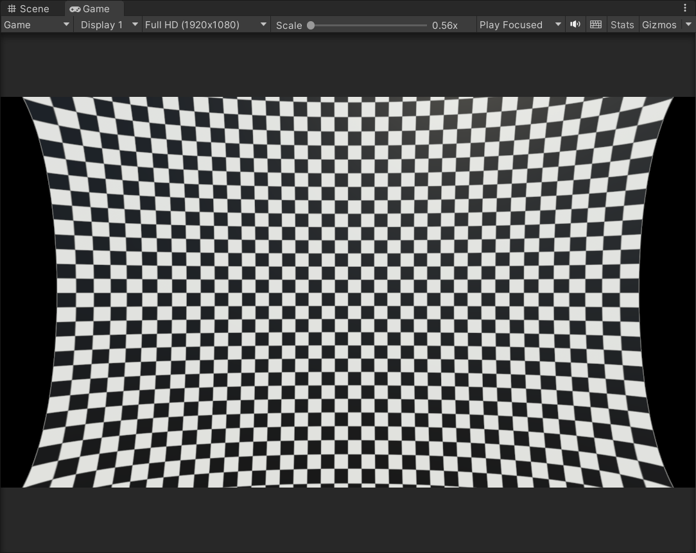
       
      <em>Simulated Pincushion Distortion (High)</em>
    </td>
  </tr>
</table>

<table>
  <tr>
    <td align="center" width="50%">
      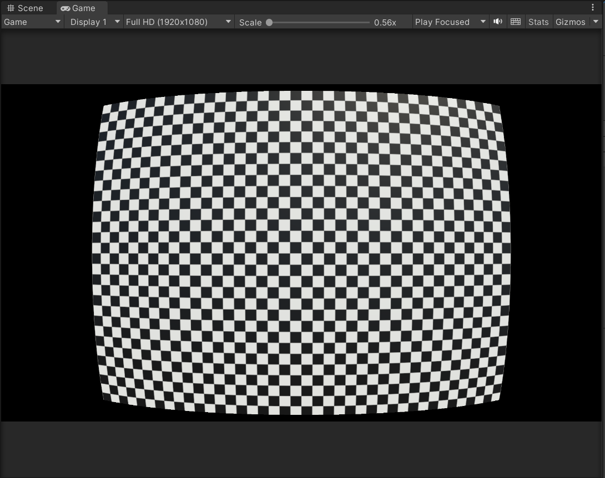
       
      <em>Pre-Corrected Image</em>
    </td>
    <td align="center" width="50%">
      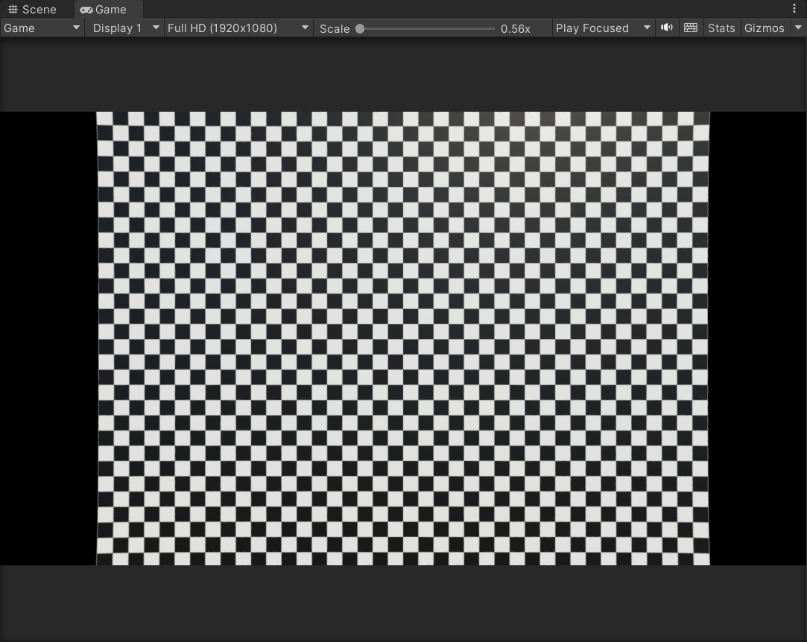
       
      <em>Distorted Image appears close to reference image</em>
    </td>
  </tr>
</table>

## Chromatic aberration (Low)
<table>
  <tr>
    <td align="center" width="50%">
      
       
      <em>Reference Image</em>
    </td>
    <td align="center" width="50%">
      
       
      <em>Simulated CA (Low)</em>
    </td>
  </tr>
</table>

<table>
  <tr>
    <td align="center" width="50%">
      
       
      <em>Pre-Corrected Image</em>
    </td>
    <td align="center" width="50%">
      
       
      <em>Distorted Image appears close to reference image</em>
    </td>
  </tr>
</table>

## Chromatic aberration (High)
<table>
  <tr>
    <td align="center" width="50%">
      
       
      <em>Reference Image</em>
    </td>
    <td align="center" width="50%">
      
       
      <em>Simulated CA (High)</em>
    </td>
  </tr>
</table>

<table>
  <tr>
    <td align="center" width="50%">
      
       
      <em>Pre-Corrected Image</em>
    </td>
    <td align="center" width="50%">
      
       
      <em>Distorted Image appears close to reference image</em>
    </td>
  </tr>
</table>

---

## How to implement

1. Open the Unity project.
2. Load a scene from the `Scenes/` folder.
3. Click on the Main Camera in the inspector pannel.
4. Use the exposed toggles and sliders to inspect distortion and correction behavior.
5. In Unity, the "games" tab is used to see the effect of modifying the toggles/sliders.

  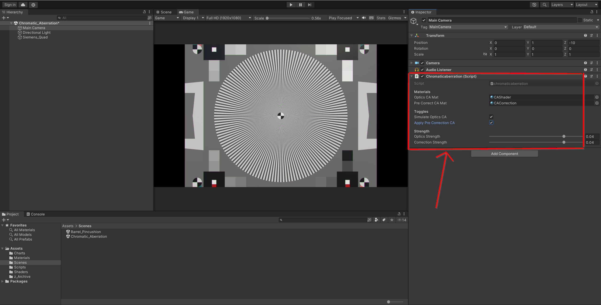
   
  <em>Modify the toggles and sliders here</em>

